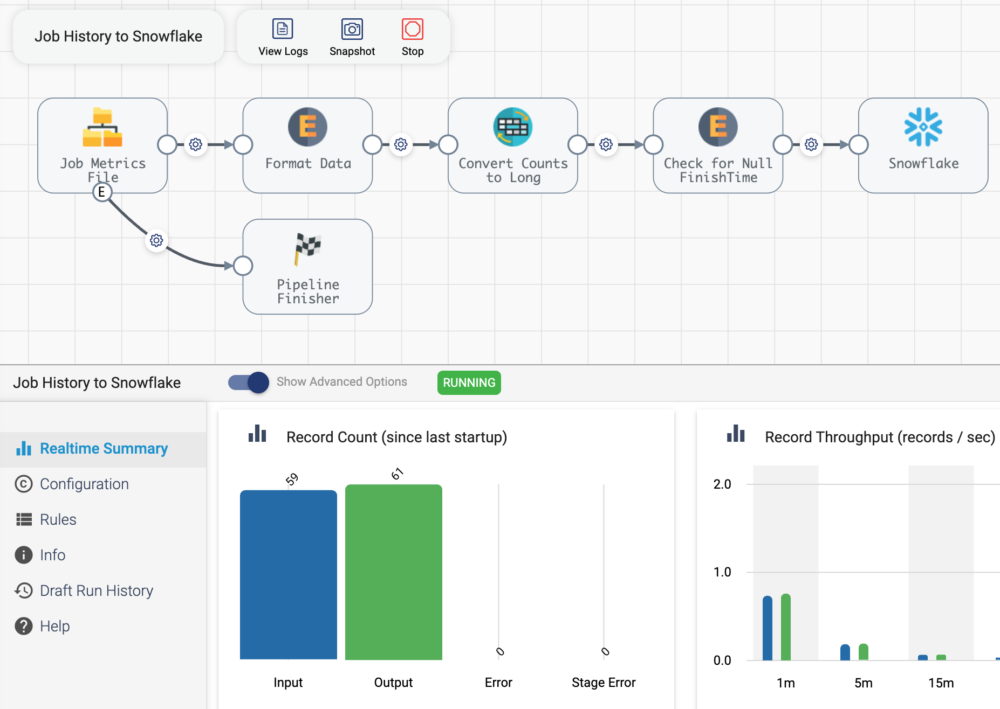
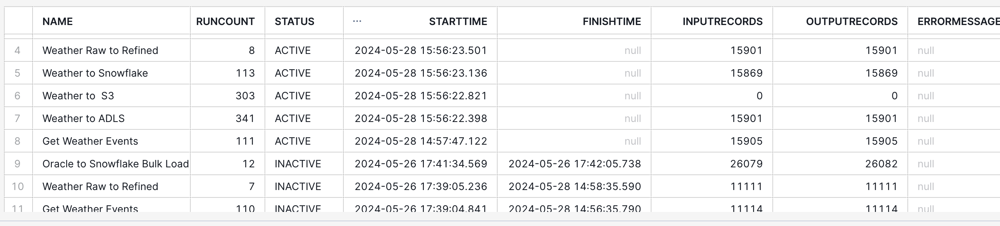

## StreamSets Job Metrics to Snowflake
This project provides an example of how to replicate StreamSets Job Metrics to Snowflake.  

This allows operators to easily run SQL queries and build custom dashboards on top of StreamSets Job metrics and history. For example, one could display a list of currently running Jobs with their record counts, or compare historical record counts and performance metrics of the same Job run every day for the past month.

*Important note: This example uses a [Shell Executor](https://docs.streamsets.com/portal/platform-datacollector/latest/datacollector/UserGuide/Executors/Shell.html#concept_jsr_zpw_tz).  For production use, make sure to configure [Data Collector Shell Impersonation Mode](https://docs.streamsets.com/portal/platform-datacollector/latest/datacollector/UserGuide/Executors/Shell.html#concept_n2w_txv_vz).*

### Design Approach
There are several ways one could implement this functionality:

- A StreamSets pipeline could use the StreamSets REST API to get Job history and metrics and merge the data into a Snowflake table. The advantages of this approach include the use of a single pipeline without needing a Shell Executor, a Snowflake connector with merge and data-drift support, scheduling, monitoring and failover; however, getting and filtering Job history and metrics using the REST API is complicated.

- Alternatively, one could use the [StreamSets SDK for Python](https://docs.streamsets.com/platform-sdk/latest/welcome/overview.html) to perform the same actions. The advantages of this approach include an elegant and convenient syntax for getting Job history and metrics, but would require custom code to merge the data into Snowflake, and has no built-in scheduling, monitoring or failover.

- A hybrid approach! This example uses a StreamSets SDK script within a pipeline to get the best of both worlds: an elegant retrieval of Job history and metrics using the SDK, and all of the operational benefits of using a StreamSets pipeline including scheduling, monitoring and failover. 

The example pipeline allows the user to set a <code>lookback</code> period that determines how far back in time to get Job history and metrics for, for example 5 minutes, 1 hour, 24 hours, 30 days, etc...  

The script is idempotent, so running it multiple times will not result in duplicate data in Snowflake. For Jobs that are actively running across two or more executions of the script, the Job run's metrics will be updated.

A Job could be created for this pipeline, and that Job could be scheduled to run as often as necessary, for example, to keep a dashboard updated every five minutes.  One could run the Job an initial time with a lookback of 30 days, and then schedule the Job to run every 5 minutes with a lookback of 5 minutes to keep things up to date.


### Prerequisites

- A Python 3.6+ environment with the StreamSets Platform SDK v6.0+ module installed. This example was tested using Python 3.11.5 and StreamSets SDK v6.3.

- StreamSets [API Credentials](https://docs.streamsets.com/portal/platform-controlhub/controlhub/UserGuide/OrganizationSecurity/APICredentials_title.html#concept_vpm_p32_qqb)

## Deploying the Example

### Deploy and Test the SDK Script
- Copy the file [get_streamsets_job_metrics.py](python/get_streamsets_job_metrics.py) to a location on the Data Collector machine. I'll copy mine to  <code>/home/mark/scripts/get_streamsets_job_metrics.py</code>

- Export your StreamSets Platform API Credentials:
```
$ export CRED_ID="..."
$ export CRED_TOKEN="..."
```

- Execute the script passing it the name of a metrics file to be written and the number of lookback minutes:

```
$ python3 get_streamsets_job_metrics.py /tmp/streamsets_job_metrics.json 60
```

You should see output like this:

```
$ python3 get_streamsets_job_metrics.py /tmp/streamsets_job_metrics.json 60
-------------------------------------
Current time is 2024-05-26 17:49:23
Lookback minutes is 60
Will get metrics for Jobs started after 2024-05-26 16:49:23
Metrics will be written to the file /tmp/streamsets_job_metrics.json
-------------------------------------
Connected to Control Hub
-------------------------------------
Found 7 Job Runs within lookback window
Writing Metrics
-------------------------------------
Done
```

Inspect the metrics file written by the script. It should look like this:

```
$ cat /tmp/streamsets_job_metrics.json
{"ID": "208e479f-c34c-4379-8529-c03d5c6d3f60:8030c2e9-1a39-11ec-a5fe-97c8d4369386", "NAME": "Get Weather Events", "CREATETIME": 1696984398077, "LASTMODIFIEDON": 1716475664195, "PIPELINENAME": "Get Weather Events", "PIPELINECOMMITLABEL": "v39", "RUNCOUNT": 110, "STARTTIME": 1716745144841, "FINISHTIME": 0, "ERRORMESSAGE": null, "COLOR": "GREEN", "STATUS": "ACTIVE", "INPUTRECORDS": 499, "OUTPUTRECORDS": 499, "ERRORRECORDS": 0}
{"ID": "fe9605ab-4912-4181-a315-e49d031a0d50:8030c2e9-1a39-11ec-a5fe-97c8d4369386", "NAME": "Oracle to Snowflake Bulk Load", "CREATETIME": 1716561746294, "LASTMODIFIEDON": 1716562027770, "PIPELINENAME": "Oracle to Snowflake Bulk Load", "PIPELINECOMMITLABEL": "v9", "RUNCOUNT": 12, "STARTTIME": 1716745294569, "FINISHTIME": 1716745325738, "ERRORMESSAGE": null, "COLOR": "GRAY", "STATUS": "INACTIVE", "INPUTRECORDS": 26079, "OUTPUTRECORDS": 26082, "ERRORRECORDS": 0}
{"ID": "de4a50a5-7f81-4f55-8dd7-1fc8614c2148:8030c2e9-1a39-11ec-a5fe-97c8d4369386", "NAME": "Weather Raw to Refined", "CREATETIME": 1716330812999, "LASTMODIFIEDON": 1716475898652, "PIPELINENAME": "Weather Raw to Refined", "PIPELINECOMMITLABEL": "v26", "RUNCOUNT": 7, "STARTTIME": 1716745145236, "FINISHTIME": 0, "ERRORMESSAGE": null, "COLOR": "GREEN", "STATUS": "ACTIVE", "INPUTRECORDS": 497, "OUTPUTRECORDS": 497, "ERRORRECORDS": 0}
...
```


### Import and Configure the pipeline
Import the pipeline from the archive file [pipelines/Job_History_to_Snowflake.zip](pipelines/Job_History_to_Snowflake.zip)

The pipeline looks like this:


Set the following pipeline parameters:

- <code>STREAMSETS_SDK_SCRIPT</code> - the path to the SDK script
- <code>LOOKBACK_MINUTES</code> - the number of previous minutes to get Job run metrics for
- <code>JOB_METRICS_FILE</code> - An absolute path to the job metrics file the SDK script will write

For example, I'll use these parameters in my environment:


Set a Snowflake Connection in the Snowflake Destination as well as all required Snowflake properties (warehouse, database, schema, table name, etc...).  I'll use the table name <code>STREAMSETS_JOB_METRICS</code>

The Snowflake Destination has <code>Table Auto Create</code> and <code>Data Drift Enabled</code> enabled, and has a composite primary-key set for the target table on the ID and RUNCOUNT columns to support CDC(merge) like this:


Note the pipeline calls the SDK script in a Start Event:


In order to avoid hard-coding API credentials into the SDK script or the pipeline, the credentials are read from the environment. In the screenshot above, you can see I have loaded the values from the files <code>CRED_ID</code> and <code>CRED_TOKEN</code> loaded as [Runtime Resources](https://docs.streamsets.com/portal/platform-datacollector/latest/datacollector/UserGuide/Pipeline_Configuration/RuntimeValues.html#concept_bs4_5nm_2s). 

*Important note: Make sure to set the Shell Executor's Environment Timeout(ms) property (see the screenshot above) to a value long enough to let the script complete. For example, if you are getting the history of tens of thousands of Jobs you might need to increase the default value.  You can run the SDK script in standalone mode as described above to observe how long the script takes to run in your environment.*


## Run the Pipeline

Run the pipeline and you should see the number of Job run metrics pulled from Control Hub and written to Snowflake:



The shell script's messages are captured in the pipeline's log:


## View the data in Snowflake

The pipeline created the following Snowflake table:


Here are some sample queries that can be run in Snowflake:

### Find all Jobs started after a particular point in time

```
select  name, status, starttime, finishtime, inputrecords, outputrecords, errormessage 
from streamsets_job_metrics 
where STARTTIME > '2024-05-24 15:08:18.394'
order by STARTTIME DESC
```




### Compare all historical runs of a given Job

```
select name, runcount, starttime, inputrecords, outputrecords, errormessage, 
from streamsets_job_metrics 
where name = 'Oracle to Snowflake Bulk Load' 
order by runcount DESC
```

Note the Job's error message captured in run #9:


### Find all Active Jobs:

```
select  name, status, starttime, inputrecords, outputrecords, errormessage 
from streamsets_job_metrics 
where status = 'ACTIVE'
order by STARTTIME DESC
```


Or course, many more queries, analytics, dashboards, and anomaly detection routines can be applied to this data.


### Capturing Oracle CDC Metrics

This project can also capture Oracle CDC Metrics, such as the metric <code>Read lag (seconds)</code> for pipelines that use the original StreamSets [Oracle CDC Client Origin](https://docs.streamsets.com/portal/platform-datacollector/latest/datacollector/UserGuide/Origins/OracleCDC.html#concept_rs5_hjj_tw) or the metric <code>Server Instant Latency</code> for pipelines that use the newer StreamSets [Oracle CDC Origin](https://docs.streamsets.com/portal/platform-datacollector/latest/datacollector/UserGuide/Origins/OracleC.html#concept_whr_2w2_bwb).

To enable capture of either of these metrics, add a Job tag with the value <code>oracle_cdc</code> to your Oracle CDC Job(s).

With that tag in place, the SDK script will capture the relevant SDC Oracle CDC gauge value, and, thanks to data-drift support in the StreamSets Snowflake Connector, will add a column named either <code>ORACLE_CDC_LAG_TIME_SECONDS</code> for the old connector or <code>ORACLE_CDC_SERVER_INSTANT_LATENCY</code> for the new connector to the <code>STREAMSETS_JOB_METRICS</code> table.

You should see additional log messages when Oracle CDC metrics are captured, like this:


Note that these latency metrics are only meaningful for ACTIVE jobs.

Here is a query that shows the metric captured for the old Oracle CDC Client origin:

```
select name, status, starttime, inputrecords, outputrecords, errorrecords, oracle_cdc_lag_time_seconds  
from streamsets_job_metrics 
where name = 'Oracle CDC to Snowflake' and status = 'ACTIVE'
```


And here is a query that shows the metric captured for the new Oracle CDC origin:

```
select  name, status, starttime, inputrecords, outputrecords, 
oracle_cdc_server_instant_latency
from streamsets_job_metrics 
where status = 'ACTIVE' and name = 'Oracle CDC to Snowflake (new Connector)'
```


As Oracle CDC gauges are not yet propagated to Control Hub, this capability requires the Python script to be able to connect directly to the Data Collector.


